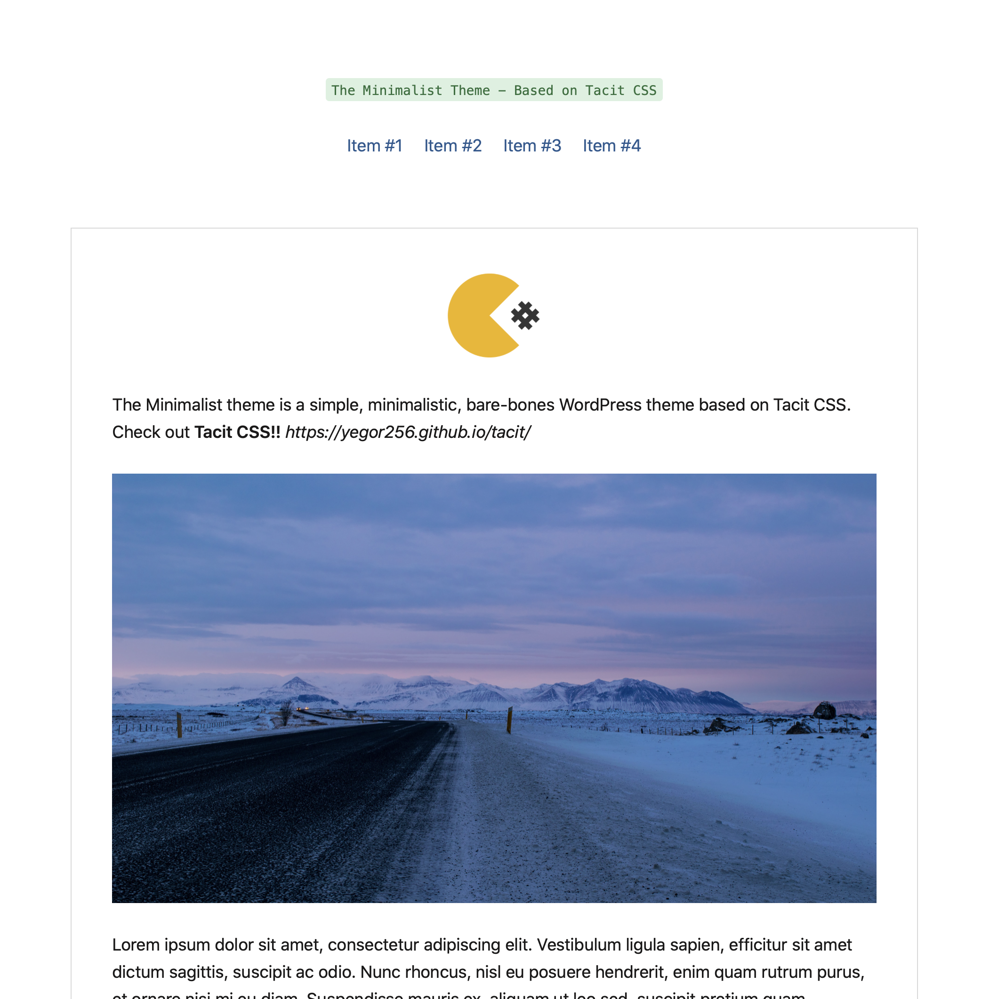

# The-Minimalist-WordPress-Theme
A WordPress theme based on Tacit CSS

## What is the Minimalist theme? 
The Minimalist is a simple, minimalistic, bare-bones theme based on [Tacit CSS](http://yegor256.github.io/tacit/).

## How to install
As usual, simply drag the theme folder to your website's `/wp-content/themes/` folder, and activate it from the WordPress Appareance tab.

## Can I modify it?
Yes! This theme is very clean written and thus, very simple to modify or customize. There are still some hard-coded parts in it, and I'm currently working on adding theme options accessible through the WordPress theme customizer.
You'll then want to fork it and work on it as you please! Check the licensing for more info.

## Menu locations
The theme allows for two menu locations: the header and the footer. 

## Archive page
To make an archive page, create a new page within WordPress, and choose the "Archive" page layout. There is no need to write anything on the page you created, the theme will fill it out for you.

## Licensing
This theme is licensed under the MIT License. You're free to fork it and modify it. For more info, you can check the license file on the project's folder.
